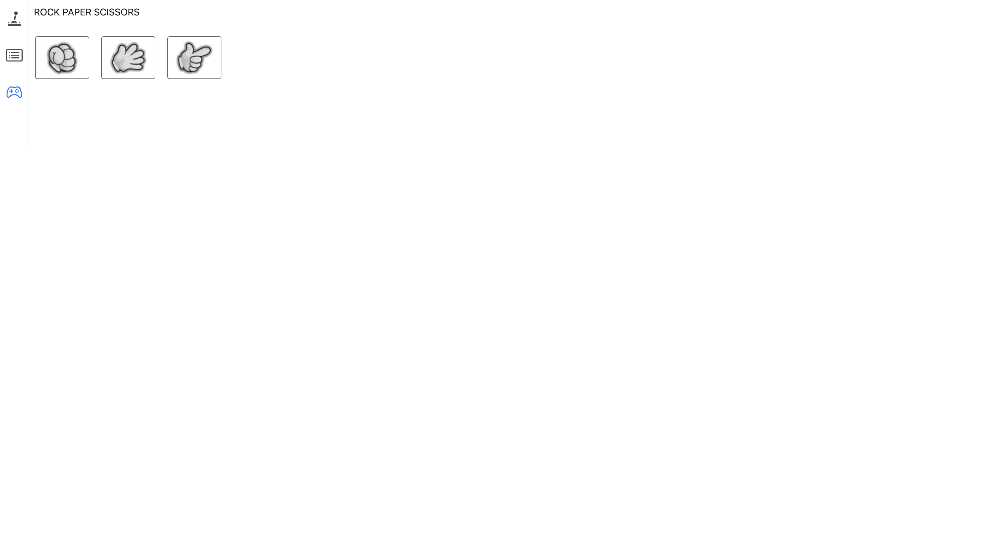

# 가위 바위 보 게임

## 데모
https://games-vue-267b1.web.app/
#### React 버전 구경하러가기
https://github.com/bereal1995/games

## 프로젝트 구성안내
### 목표
- 저번에 리액트로 만들었던 가위바위보게임을 뷰로 만들어보자!

### 기술 스택
- vuex
    - redux처럼 상태관리를 위해서 사용
    - firebase를 통해서 데이터값을 가져오기 위해서는 비동기 작업을 해야하는데  
      이때, 데이터를 스토어에 저장하기 위해 사용
- firebase
    - 실시간으로 데이터연동을 통한 온라인 게임플레이를 위해 realtimeDatabase를 사용
    - 배포를 하기 위해 firebase hosting 사용
- bootstrap
    - 디자인이 없는 상황에서 안정적이고 완성도있는 UI를 사용하기 위해 선택
    - UI관련 라이브러리중에서 제일 사용자가 많아 선택 (npmtrend 기준)
- dotenv
    - 외부에 노출되면 안되는 환경변수 관리를 위해 설치  
      ex) API_KEY, APP_ID ....
- vue-uuid (고유 키 값 생성)
    - 게임 방을 만들때 사용자를 구분하기 위해 사용
    - 이 uid값으로 host, challenger 구분을 한다.

## 폴더트리 구조
```text
├── firebase.json
├── package.json
├── public
│   ├── favicon.ico
│   └── index.html
├── src
│   ├── App.vue
│   ├── assets
│   │   ├── img
│   │   └── scss
│   ├── components
│   │   ├── Game
│   │   │   ├── Game.vue
│   │   │   ├── Play.vue
│   │   │   ├── Result.vue
│   │   │   └── Wait.vue
│   │   ├── GameList
│   │   │   └── List.vue
│   │   ├── Header.vue
│   │   ├── Home.vue
│   │   └── Nav.vue
│   ├── lib
│   │   └── firebase.js
│   ├── main.js
│   ├── router
│   │   └── index.js
│   ├── store
│   │   ├── index.js
│   │   └── moduleRps.js
│   └── utlls
│       ├── storageUtill.js
│       └── urlUtill.js
```

## 프로젝트 설치방법
```sh
# 프로젝트 설치
yarn
```


## 프로젝트 사용법
```sh
# 프로젝트 실행
yarn serve
```

## 프로젝트 기능설명
### 게임방 생성 페이지

- 게임을 시작하기 위해 방을 만들고, 방 목록을 확인할 수 있는 페이지 입니다.
- create버튼을 누르면 게임방을 만들 수 있습니다.
- public을 체크하면 고유한 키값으로 방을 만들어 온라인으로 즐길 수 있습니다.
- Join에 있는 숫자와 리스트는 현재 만들어져있는 방들입니다.
- options의 값만큼 승리하게 되면 게임을 종료하게 돱니다.
### 게임 플레이 페이지

- 아직 상대방이 들어오지 않은 대기중 페이지입니다.
- copy버튼을 눌러 주소를 복사하고 해당 주소로 상대방이 들어오면 게임이 시작됩니다.
- 1개의 디바이스로 게임을 하시는 경우 각 다른 브라우저로 접속하면 이용이 가능합니다.


- 방을 만든 호스트와 도전자가 모두 들어와 게임시작화면 입니다.
- 서로 각각 가위바위보 중에 원하는 값을 눌러 선택합니다.
- 2명 중 한명이라도 선택을 안하면 다음 화면으로 넘어가지 않습니다.


- 1판이 끝날때 마다 나오는 결과 창입니다.
- 게임 결과값들이 테이블로 출력됩니다.
- again버튼을 2명이 모두 누르면 다음판으로 넘어갈 수 있습니다.


- 게임이 모두 끝난 결과 입니다.
- 승자 혹은 패자가 나오고 게임은 끝납니다.


## 프로젝트 만들면서..
https://bereal1995.github.io/sideproject/rps-game-vue/

## 저작권 및 사용자 정보
© 2021 HH gygud98@gmail.com


## 프로그램 작성자 및 도움을 준 사람
- https://github.com/bereal1995
- https://github.com/ovdncids


## 버전
### 1.0.0 (2021. 07. 15)
- 첫번째 출시